# Simulation Project: Computing Machine (Machine 5)
This is a Python-based IEEE-754 decimal double-precision web application that (1) converts decimal inputs to decimal-based double-precision format, (2) demonstrate rounding methods, and (3) perform subtraction and division using the GRS method.

## Project / Website Overview

- Tech Stack: Python 3.14 & Streamlit
- Website link: https://csarch2-g9-computingmachine.streamlit.app/
- Video walkthrough: [TODO]
- Test cases sheets: https://docs.google.com/spreadsheets/d/19xCDzQA-V0uNovz8T2U6aAiGpF4vGW13U0wMaOC8z7Q/edit?usp=sharing

## How to Run Locally

Please make sure you are using a compatible version (Python 3.14).

1. Create a virtual environment.  

    Check first your default version `python --version`. 
    If your default version is 3.14:
    ```pwsh
    python -m venv .venv
    ```

    If not (but you have downloaded it):
    ```pwsh
    python3.14 -m venv .venv
    ```

2. Activate & install requirements.
    ```pwsh
    .venv\Scripts\Activate.ps1
    pip install -r requirements.txt
    ```
3. Start the Streamlit app.
    ```pwsh
    streamlit run app.py
    ```

## Analysis Write-up
detailed analysis of the test cases covered, comparison if operations done, and add specifications and parameters of operations.

### Decimal to Decimal-based Double Precision Conversion
This part of the machine simulation converts decimal inputs into an IEEE-754 double-precision representation using **64 bits** (1 sign bit, 11 exponent bits, and 52 fraction bits), with an exponent bias (`exp'`) of **1023**. The conversion accepts decimal values, signed values, and scientific notation. The implementation determines the sign from the input, converts the magnitude to binary, determines the binary exponent, normalizes representable values to the form `1.x...x × 2^exp`, computes the biased exponent, and stores the resulting fraction. The representable magnitude ranges from **~2.23 × 10^-308** as the smallest normal magnitude to **~1.8 × 10^308** as the largest magnitude. Up to **1200 fractional bits** are computed before retaining the 52-bit fraction to provide additional precision and leeway when processing very small values. The final fraction is rounded using the **round-to-nearest, ties-to-even** method to match the rounding behavior used internally by Python for double-precision floating-point values and because it is the standard rounding method used. The implementation still has limits for values that become too small to represent within the available precision and may eventually result in zero.

This implementation covers normal values and special cases such as signed zeroes, denormalized values, infinity, and invalid inputs or NaN, specifically quiet NaN (qNaN). The normal-value cases include integers, fractional values, scientific notation, positive and negative values, and values requiring fractional rounding.

<p align="center">
  
</p>

As an exemplary normal case, an input of `0.3` demonstrates the conversion of a decimal fraction that cannot be represented exactly in binary and therefore requires the implemented 52-bit fraction rounding. All normal-value cases matched the expected binary and hexadecimal representations.

<p align="center">
  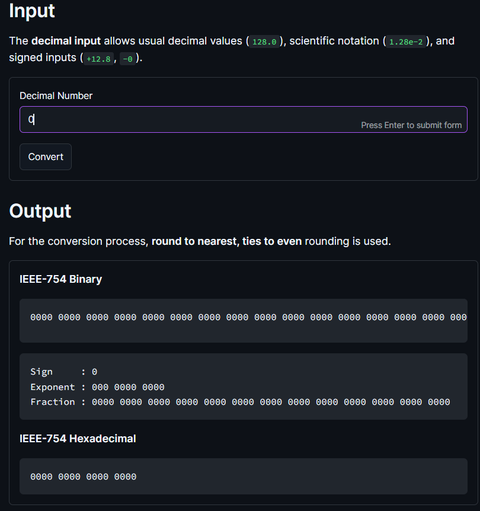
  
</p>

Special-value testing covers both signed zeroes, denormalization, positive and negative infinity, and qNaN. For signed zeroes, an input of `0` or `+0` produces a positive sign bit while `-0` correctly produces a negative sign bit, with the exponent and fraction fields remaining zero.

<p align="center">
  
</p>

For the denormalization or underflow case, `0.02e-310` is below the smallest normal magnitude of **~2.23 × 10^-308** and is therefore handled by setting the exponent field to zero, or pegging the exponent to `-1022`, while retaining the significant bits in the fraction field. This allows values below the normal range to remain representable as subnormal values rather than immediately becoming zero.

<p align="center">
  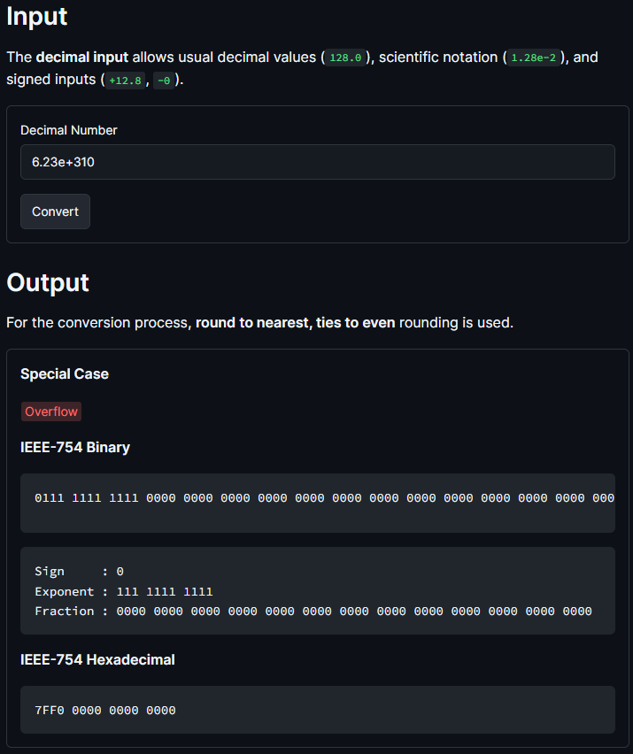
  
</p>

For positive overflow or infinity, `6.23e+310` exceeds the largest representable magnitude of **~1.8 × 10^308** and is represented as positive infinity with an all-one exponent and zero fraction. The same process applies to negative overflow, such as `-2.34e+999`, except that the sign bit is negative.

<p align="center">
  
</p>

For invalid inputs such as `abcdefg`, the implementation uses a fixed qNaN representation, `7FFFFFFFFFFFFFFF`. This case covers strings that cannot be parsed as decimal values. A fixed qNaN was used because a decimal input cannot directly express the different NaN results that could arise from floating-point operations, such as invalid arithmetic operations. This also provides a consistent representation comparable to [similar IEEE-754 converters online](https://www.binaryconvert.com/convert_double.html?decimal=048046051).

For validation, every test case compared the manually implemented conversion against Python's IEEE-754 double-precision representation of each decimal value, generated through `struct.pack("!d", ...)` and `struct.unpack("!Q", ...)`. This allowed the verification of the 64-bit binary representation, hexadecimal representation, and special-case classification. **All 23 test cases created for this scenario of the machine passed**.

### Rounding Methods

Now, a part of the machine simulation also demonstrates the four rounding methods for decimal and binary: `chopping`, `round up`, `round down`, and `round to nearest ties-to-even`.

The user (1) selects the input format, (2) enters a number, and (3) specifies the target number of significant digits. In this implementation, the target number of digits refers to `significant digits`, not decimal places, since floating-point precision is based on the number of meaningful digits that can be stored.

The rounding process starts by parsing the input according to its selected format. 
- Decimal inputs are parsed using base 10, while binary inputs are parsed using base 2.

After parsing, the program identifies the sign, whole part, fractional part, significant digits, and discarded tail. 
- The first target number of significant digits are kept
- the remaining digits are used to determine whether each rounding method should increment the retained value. 

The program then rebuilds the rounded output and displays whether the result was incremented, changed, and what discarded tail was used. The four rounding methods differ mainly in how they treat the discarded tail. 
- **Chopping** simply keeps the target significant digits and discards the rest, which rounds toward zero. 
- **Round up** rounds toward positive infinity when a nonzero discarded tail exists.
- **Round down** rounds toward negative infinity when a nonzero discarded tail exists. 
- **Round-to-nearest ties-to-even** chooses the closest representable value, and if the discarded portion is exactly halfway, it chooses the result whose last kept digit is even. This reduces rounding bias compared to always rounding halfway cases upward. 

1) Normal Positive Decimal
<p align="center"> 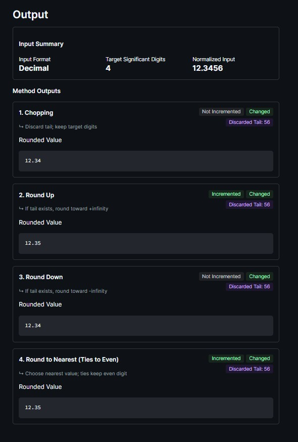 </p> 
As a normal decimal case, the input `12.3456` with `4` target significant digits demonstrates how the same value produces different outputs depending on the rounding method. Chopping and round down produce `12.34`, while round up and round-to-nearest ties-to-even produce `12.35`. This shows how methods that use the discarded tail can change the final stored value. 

2) Normal Negative Decimal
<p align="center"> 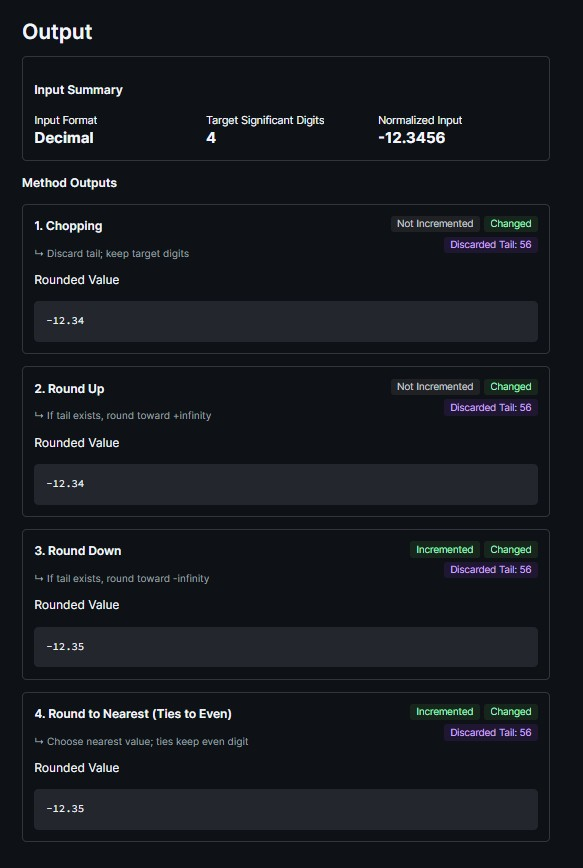 </p>
Negative values were also tested to verify the directional behavior of round up and round down. For `-12.3456` with `4` target significant digits, round up produces `-12.34` because it moves toward positive infinity, while round down produces `-12.35` because it moves toward negative infinity. This confirms that the sign of the input affects directional rounding. 


3) Ties-to-Even Decimal
<p align="center"> 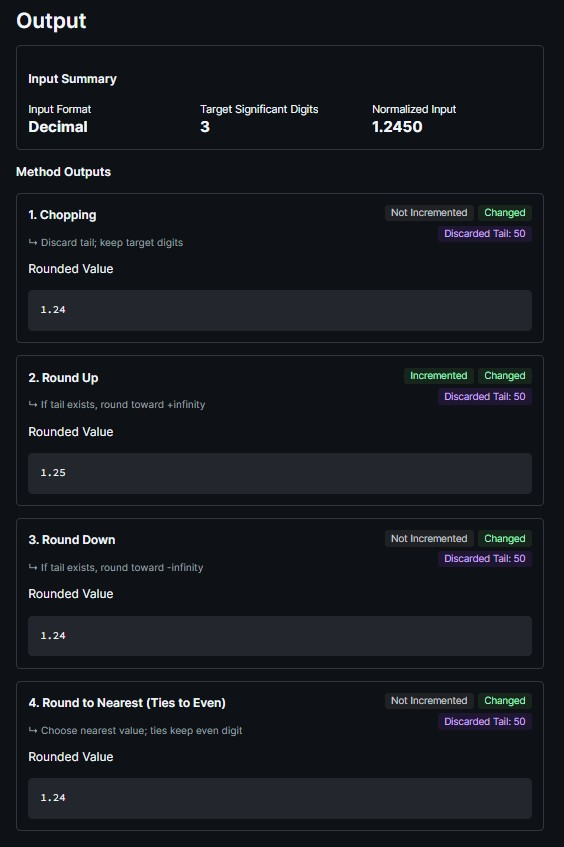 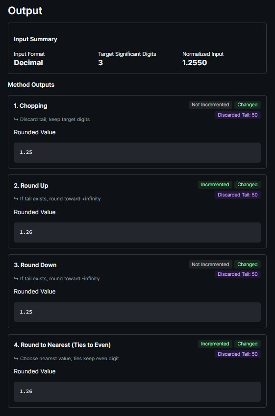 </p>
Tie cases were tested using `1.2450` and `1.2550` with `3` target significant digits. For `1.2450`, the last kept digit is even, so round-to-nearest ties-to-even keeps the result as `1.24`. For `1.2550`, the last kept digit is odd, so the method increments the result to `1.26`. These cases verify that the implementation correctly applies parity checking during exact halfway cases. 

4) Binary Cases
<p align="center"> 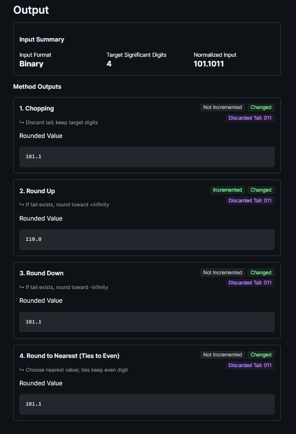 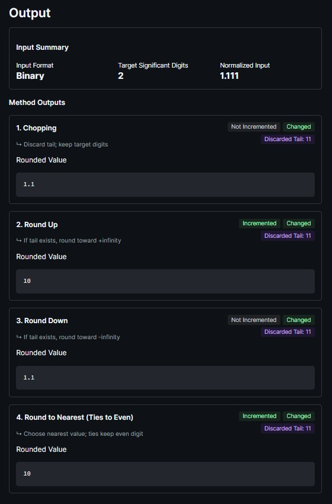 </p>
Binary inputs were tested separately to confirm that the same rounding pipeline works in base 2. For `101.1011` with `4` target significant digits, the discarded tail is `011`, and the program correctly shows different outputs depending on whether the method increments. A binary carry overflow case was also tested using `1.111` with `2` target significant digits. In this case, incrementing the kept digits causes the value to shift from `1.1` to `10`, confirming that the program handles carry propagation correctly. 

5) Zero Cases
<p align="center"> 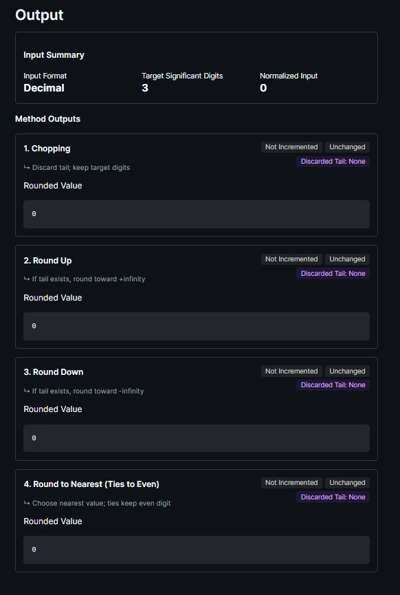 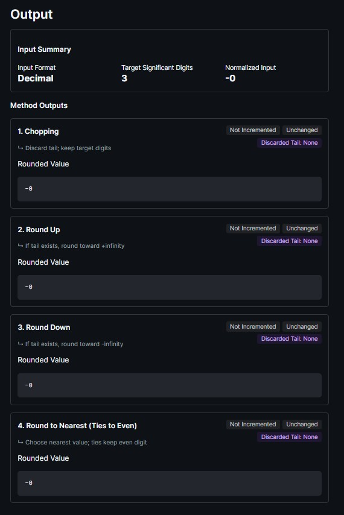 </p> 
Special cases include zero and signed zero. For `0`, all four methods return `0` and remain unchanged because there are no significant discarded digits. For `-0`, the sign is preserved and all four methods return `-0`. This verifies that the rounding module handles zero values without incorrectly changing their sign or value. 

6) Invalid Cases
<p align="center"> 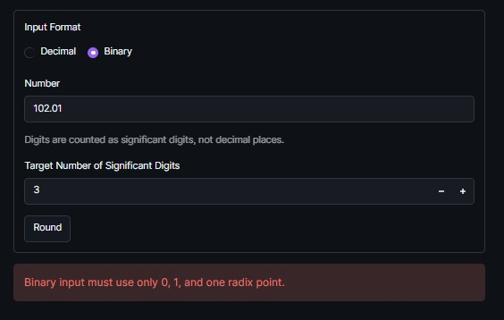 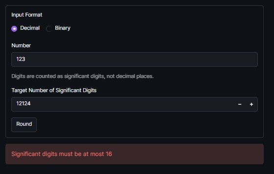 </p>
Invalid input cases were also tested. Invalid decimal text such as `abc`, invalid binary digits such as `102.01`, invalid binary structure such as `1..01`, empty input, and invalid target digit counts are rejected with error messages. The target number of significant digits is restricted to values from **1 to 16**, matching the decimal precision limit used in the implementation. For validation, the rounding methods were tested across normal decimal values, negative values, exact ties, small decimal values, binary values, binary carry overflow, zero and signed zero, scientific notation, and invalid inputs. The test case sheet contains **22 rounding test cases**, covering valid, invalid, edge, and special cases for this scenario. **All 22 test cases created for this scenario of the machine passed**.

### Arithmetic Operations (Subtraction and Division)
#### Division (GRS Method)
This part of the machine simulation performs IEEE-754 double-precision division on two 64-bit operands (accepted in either Decimal or IEEE Hexadecimal format) using the **Guard, Round, and Sticky (GRS) bits** hardware algorithm. The implementation systematically parses the operands into their sign, 11-bit exponent, and 52-bit fraction components. The division process computes the tentative exponent by subtracting the unbiased exponents of the operands. To process the significands, the dividend's fraction (with its implicit bit) is shifted left by 54 bits prior to integer division. This ensures the generation of exactly enough bits to fill the 52-bit fraction, along with the Guard (G) and Round (R) bits. The remainder of this integer division determines the Sticky (S) bit. The resulting quotient is then normalized (shifting left and decrementing the exponent if the most significant bit is 0) and rounded using the **round-to-nearest, ties-to-even** method based on the extracted G, R, and S bits.

This implementation covers normal decimal division, alternative IEEE Hexadecimal input formats, special cases such as division by zero and NaN, and edge cases involving overflow and underflow. As an exemplary normal case, dividing standard floating-point values (`TC1`) demonstrates the step-by-step extraction of the GRS bits and the ties-to-even rounding logic. Furthermore, the machine supports direct IEEE Hexadecimal inputs (`TC9`), parsing 16-character hex strings into binary before routing them through the exact same GRS division pipeline.

<p align="center">
  
  
</p>
<p align="center">
  
</p>
<p align="center">
  
  
</p>

All normal-value cases matched the expected binary and hexadecimal representations. For special-value handling, the implementation strictly adheres to IEEE-754 rules via early detection to prevent unnecessary computation. For example, dividing a non-zero number by zero (`TC4`) triggers a special case warning badge and returns signed Infinity, while dividing zero by zero or processing invalid inputs correctly returns quiet NaN (qNaN).

<p align="center">
  
  
</p>

Edge cases involving extreme exponent ranges are handled during the final result packing phase. For positive or negative overflow (`TC7`), when the resulting biased exponent meets or exceeds **2047**, the module flags an overflow and outputs Infinity with the appropriate sign bit. For underflow (`TC8`), when the exponent drops below **1**, the module denormalizes the fraction by shifting it right based on the exponent deficit, representing the result as a subnormal float rather than truncating immediately to zero.

<p align="center">
  
  
</p>
<p align="center">
  
  
</p>

For validation, the manually implemented step-by-step GRS division was tested against Python's native hardware division using `float` operations packed and unpacked via the `struct` module (`struct.pack("!d", ...)` and `struct.unpack("!Q", ...)`). This allowed full verification of the 64-bit binary representation, hexadecimal output, and special-case classification. **All division test cases created for this scenario of the machine passed.**

#### Subtraction (GRS Method)
This part of the machine simulation performs IEEE-754 double-precision subtraction on two 64-bit operands (accepted in either Decimal or IEEE Hexadecimal format) using the **Guard, Round, and Sticky (GRS) bits** hardware algorithm. The implementation systematically parses the operands into their sign, 11-bit exponent, and 52-bit fraction components. Since subtraction is defined as `A - B = A + (-B)`, the sign bit of the second operand is flipped so the operation can be processed as a signed addition. The two operands are then ordered by magnitude, and the significand of the smaller-magnitude operand (with its implicit bit) is aligned to the larger operand's exponent by shifting it right by the exponent difference. During this alignment, the bits shifted out are preserved as the Guard (G) and Round (R) bits, while every remaining bit shifted past the Round position is OR-ed into the Sticky (S) bit. The aligned significands are then added when the effective signs match or subtracted when they differ. The result is normalized (shifting right and incrementing the exponent on a carry-out, or shifting left and decrementing the exponent to correct cancellation) and rounded using the **round-to-nearest, ties-to-even** method based on the extracted G, R, and S bits.

This implementation covers normal decimal subtraction, alternative IEEE Hexadecimal input formats, special cases such as Infinity and NaN, and edge cases involving cancellation, overflow, and underflow. As an exemplary normal case, subtracting standard floating-point values (`TC1`, `12.5 - 2.0`) demonstrates the step-by-step alignment, GRS extraction, and ties-to-even rounding logic, and a negative-result case (`TC2`, `-100.0 - 4.0`) confirms correct sign handling.

<p align="center">
  
  
</p>

A repeating-fraction case (`TC3`, `0.3 - 0.1`) further shows how the GRS bits drive correct rounding when the true result cannot be represented exactly in the 52-bit fraction, producing the expected `0.19999999999999998`.

<p align="center">
  
</p>

All normal-value cases matched the expected binary and hexadecimal representations. The machine also supports direct IEEE Hexadecimal inputs (`TC6`, `TC7`), parsing 16-character hex strings into binary before routing them through the exact same GRS subtraction pipeline. For special-value handling, the implementation strictly adheres to IEEE-754 rules via early detection to prevent unnecessary computation. Subtracting two like-signed infinities (`TC6`, `Infinity - Infinity`) is an invalid operation and correctly returns quiet NaN (qNaN) with a special case warning badge, while subtracting a finite value from infinity (`TC7`) returns signed Infinity.

<p align="center">
  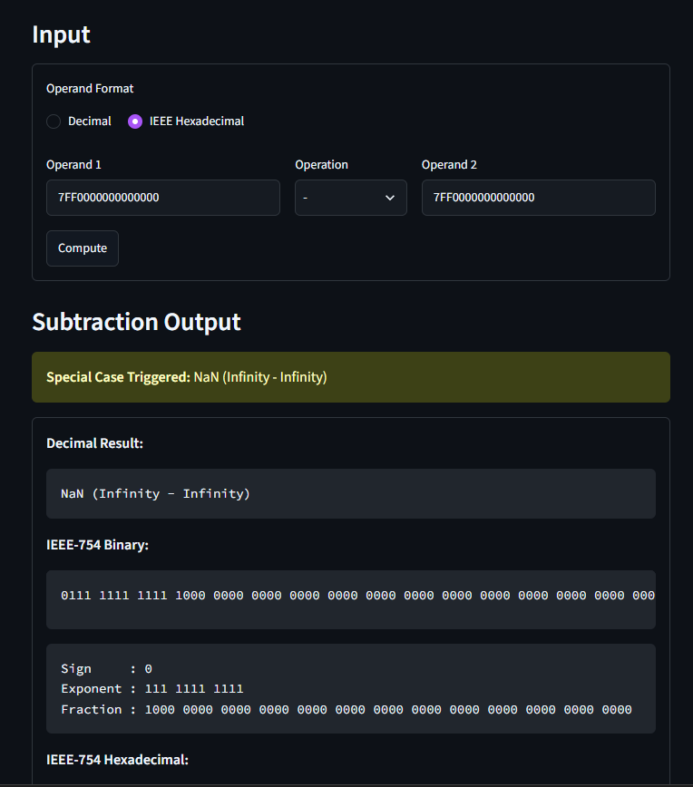
  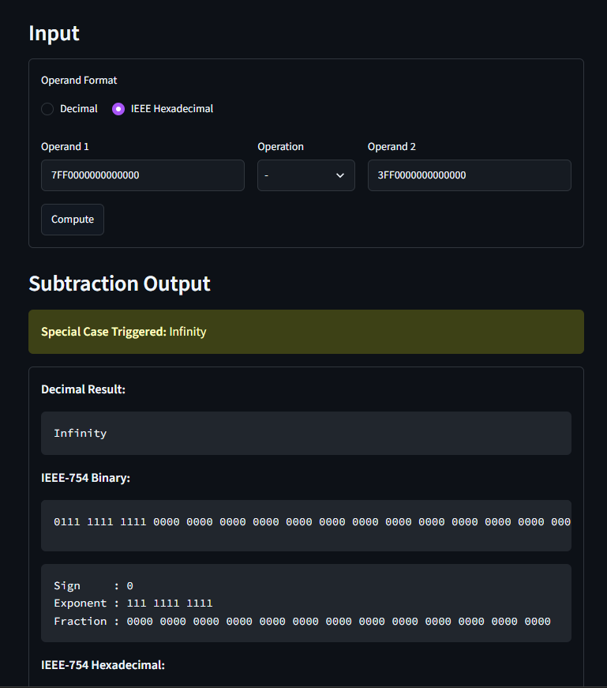
</p>

Subtracting zero from a value (`TC4`, `A - 0`) returns the value unchanged, and subtracting two equal operands (`TC5`) produces a correctly-signed zero through exact cancellation rather than a spurious nonzero result. Invalid or non-numeric inputs (`TC10`) are likewise represented as qNaN.

<p align="center">
  
  
</p>
<p align="center">
  
</p>

Edge cases involving extreme exponent ranges are handled during the final result packing phase. For positive or negative overflow (`TC8`), when the resulting biased exponent meets or exceeds **2047**, the module flags an overflow and outputs Infinity with the appropriate sign bit. For underflow (`TC9`), when the biased exponent drops below **1**, the module denormalizes the fraction by shifting it right based on the exponent deficit, representing the result as a subnormal float rather than truncating immediately to zero.

<p align="center">
  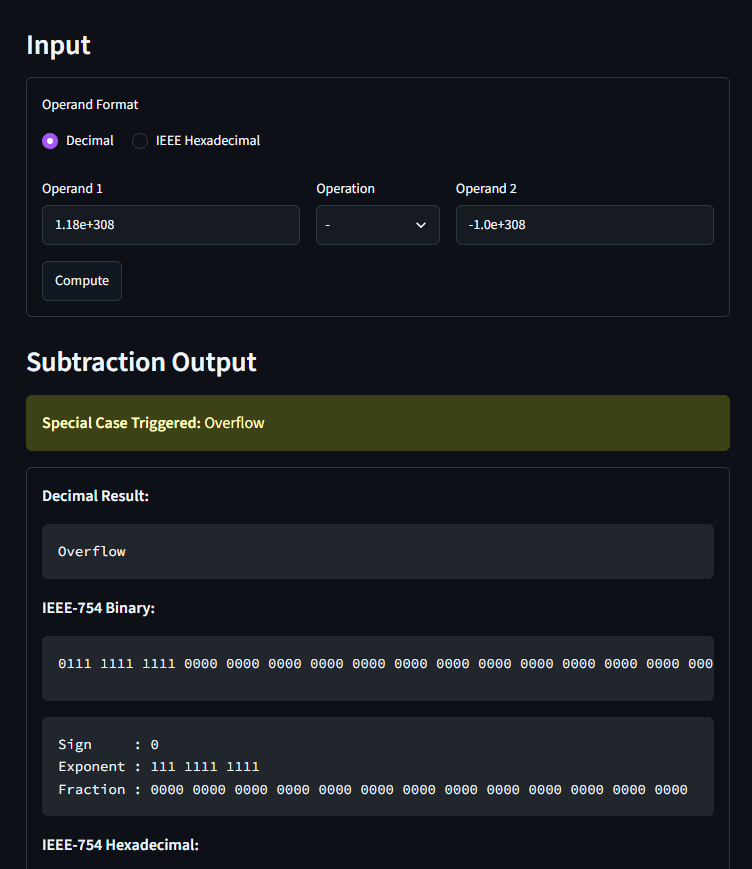
  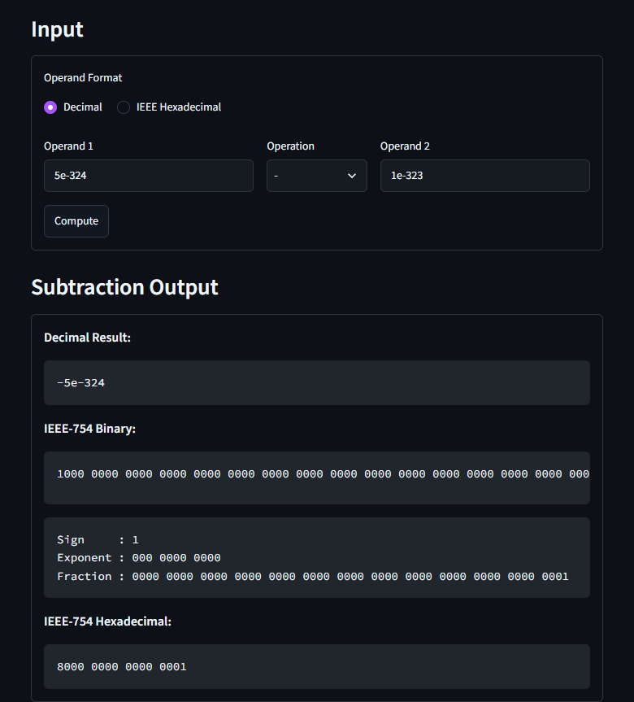
</p>

## Group 09 - S03
Chong, Kimberly;
Hereula, Adolfo Jr.;
Ho, Denise Liana;
Miranda, Isaiah;
Sarroza, Mikael
