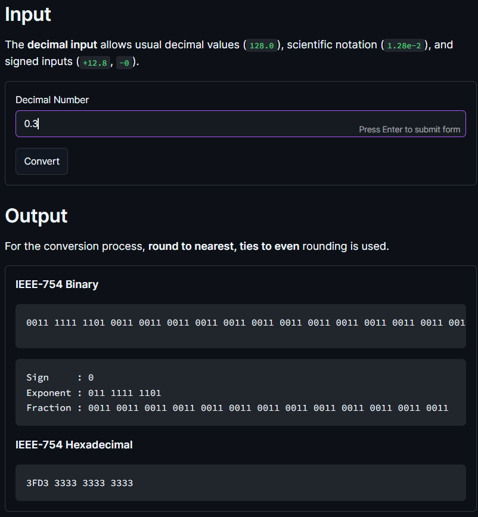
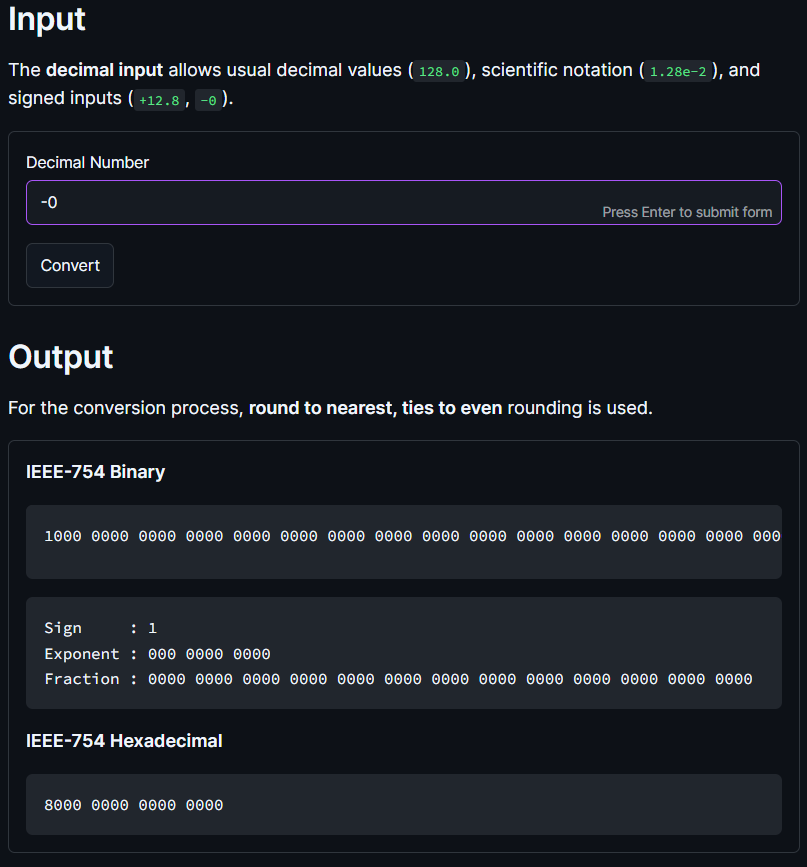
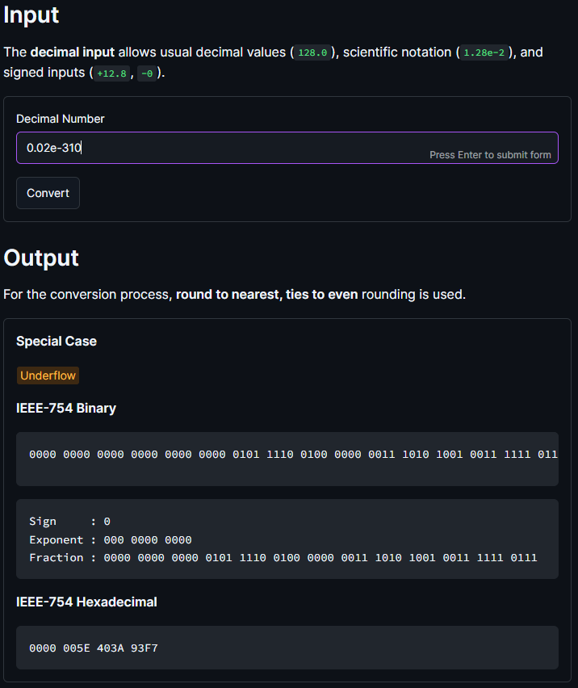
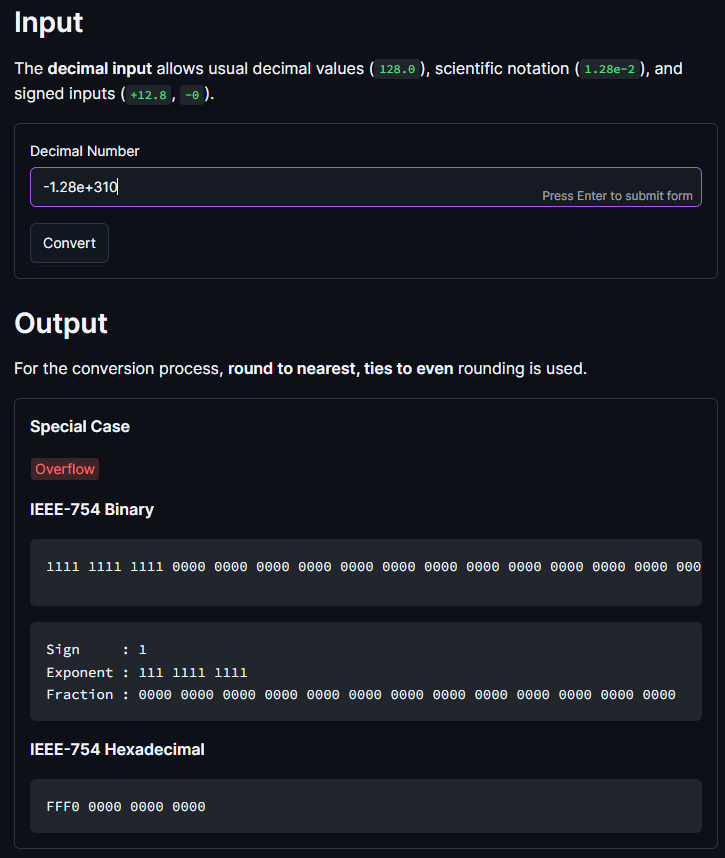
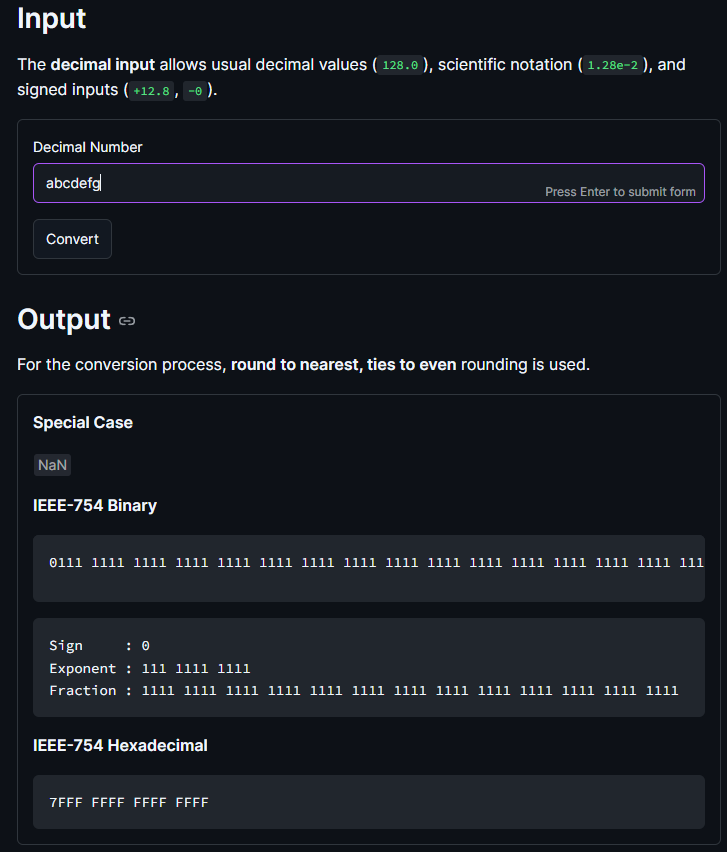

# Simulation Project: Computing Machine (Machine 5)
This is a Python-based IEEE-754 decimal double-precision web application that (1) converts decimal inputs to decimal-based double-precision format, (2) demonstrate rounding methods, and (3) perform subtraction and division using the GRS method.

## Project / Website Overview

- Tech Stack: Python 3.14 & Streamlit
- Website link: https://csarch2-g9-computingmachine.streamlit.app/
- Video walkthrough: [TODO]
- Test cases sheets: https://docs.google.com/spreadsheets/d/19xCDzQA-V0uNovz8T2U6aAiGpF4vGW13U0wMaOC8z7Q/edit?usp=sharing

## How to Run Locally

Please make sure you are using a compatible version (Python 3.14).

1. Create a virtual environment.  

    Check first your default version `python --version`. 
    If your default version is 3.14:
    ```pwsh
    python -m venv .venv
    ```

    If not (but you have downloaded it):
    ```pwsh
    python3.14 -m venv .venv
    ```

2. Activate & install requirements.
    ```pwsh
    .venv\Scripts\Activate.ps1
    pip install -r requirements.txt
    ```
3. Start the Streamlit app.
    ```pwsh
    streamlit run app.py
    ```

## Analysis Write-up
detailed analysis of the test cases covered, comparison if operations done, and add specifications and parameters of operations.

### Decimal to Decimal-based Double Precision Conversion
This part of the machine simulation converts decimal inputs into an IEEE-754 double-precision representation using **64 bits** (1 sign bit, 11 exponent bits, and 52 fraction bits), with an exponent bias (`exp'`) of **1023**. The conversion accepts decimal values, signed values, and scientific notation. The implementation determines the sign from the input, converts the magnitude to binary, determines the binary exponent, normalizes representable values to the form `1.x...x × 2^exp`, computes the biased exponent, and stores the resulting fraction. The representable magnitude ranges from **~2.23 × 10^-308** as the smallest normal magnitude to **~1.8 × 10^308** as the largest magnitude. Up to **1200 fractional bits** are computed before retaining the 52-bit fraction to provide additional precision and leeway when processing very small values. The final fraction is rounded using the **round-to-nearest, ties-to-even** method to match the rounding behavior used internally by Python for double-precision floating-point values and because it is the standard rounding method used. The implementation still has limits for values that become too small to represent within the available precision and may eventually result in zero.

This implementation covers normal values and special cases such as signed zeroes, denormalized values, infinity, and invalid inputs or NaN, specifically quiet NaN (qNaN). The normal-value cases include integers, fractional values, scientific notation, positive and negative values, and values requiring fractional rounding.

<p align="center">
  
</p>

As an exemplary normal case, an input of `0.3` demonstrates the conversion of a decimal fraction that cannot be represented exactly in binary and therefore requires the implemented 52-bit fraction rounding. All normal-value cases matched the expected binary and hexadecimal representations.

<p align="center">
  
  
</p>

Special-value testing covers both signed zeroes, denormalization, positive and negative infinity, and qNaN. For signed zeroes, an input of `0` or `+0` produces a positive sign bit while `-0` correctly produces a negative sign bit, with the exponent and fraction fields remaining zero.

<p align="center">
  
</p>

For the denormalization or underflow case, `0.02e-310` is below the smallest normal magnitude of **~2.23 × 10^-308** and is therefore handled by setting the exponent field to zero, or pegging the exponent to `-1022`, while retaining the significant bits in the fraction field. This allows values below the normal range to remain representable as subnormal values rather than immediately becoming zero.

<p align="center">
  
  
</p>

For positive overflow or infinity, `6.23e+310` exceeds the largest representable magnitude of **~1.8 × 10^308** and is represented as positive infinity with an all-one exponent and zero fraction. The same process applies to negative overflow, such as `-2.34e+999`, except that the sign bit is negative.

<p align="center">
  
</p>

For invalid inputs such as `abcdefg`, the implementation uses a fixed qNaN representation, `7FFFFFFFFFFFFFFF`. This case covers strings that cannot be parsed as decimal values. A fixed qNaN was used because a decimal input cannot directly express the different NaN results that could arise from floating-point operations, such as invalid arithmetic operations. This also provides a consistent representation comparable to [similar IEEE-754 converters online](https://www.binaryconvert.com/convert_double.html?decimal=048046051).

For validation, every test case compared the manually implemented conversion against Python's IEEE-754 double-precision representation of each decimal value, generated through `struct.pack("!d", ...)` and `struct.unpack("!Q", ...)`. This allowed the verification of the 64-bit binary representation, hexadecimal representation, and special-case classification. **All 23 test cases created for this scenario of the machine passed**.

### Rounding Methods
[TODO]
### Arithmetic Operations (Subtraction and Division)
[TODO]


## Group 09 - S03
Chong, Kimberly;
Hereula, Adolfo Jr.;
Ho, Denise Liana;
Miranda, Isaiah;
Sarroza, Mikael
